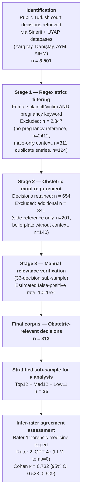

# Figure 1 — PRISMA-style Flow Diagram of Court Decision Selection

This diagram should be rendered as a publication-quality figure (300 dpi TIFF or vector PDF) using draw.io, Inkscape, or similar before submission.

## Mermaid source (preview)

## Numerical breakdown (text equivalent for accessibility)

| Stage | Inclusion criterion | n included | n excluded | Cumulative reason for exclusion |
|---|---|---|---|---|
| Identification | All Turkish public court decisions retrieved | 3,501 | — | — |
| Stage 1 | Regex: female + pregnancy keyword | 654 | 2,847 | No pregnancy ref (2,412); male-only (311); duplicate (124) |
| Stage 2 | Obstetric motif present in main paragraph | 313 | 341 | Side-reference (201); boilerplate (140) |
| Stage 3 | Manual verification (sub-sample n=36) | 313 (estimated FP 10–15%) | — | False-positive rate flagged for prospective recalibration |
| κ analysis | Stratified Top12+Med12+Low11 | 35 | 278 | Sampled stratified by score |

## Caption (suggested)

> **Figure 1.** PRISMA-style flow diagram of court-decision selection and downstream sub-sampling for inter-rater reliability assessment. From an initial retrieval of 3,501 public Turkish court decisions (Yargıtay, Danıştay, AYM, AİHM), a three-stage filtering pipeline (regex strict → obstetric motif requirement → manual verification on a 36-decision audit sub-sample) yielded 313 obstetric-relevant decisions. A stratified sub-sample (n=35; Top12 + Med12 + Low11) was used for the exploratory inter-rater reliability analysis (Cohen κ = 0.732, 95% CI 0.523–0.909).
